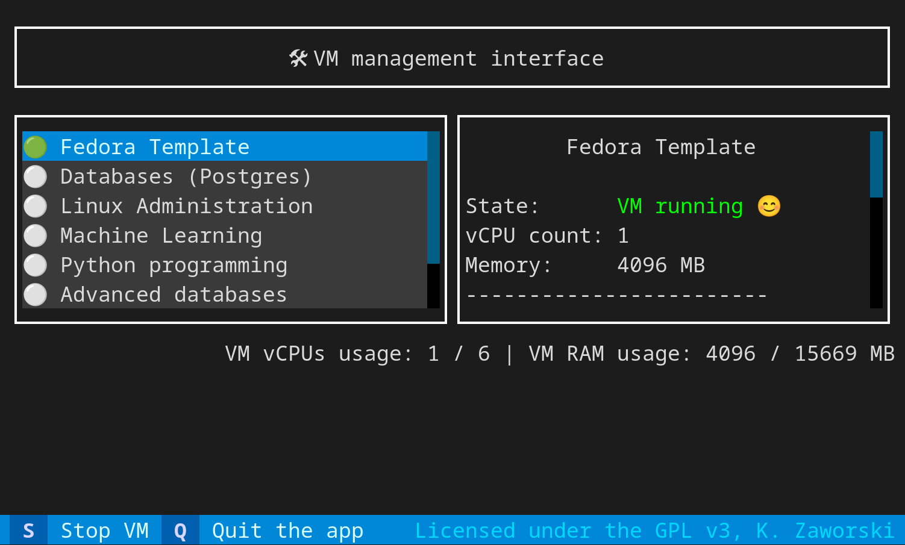

# App preview



# Installation
```
yum install git g++ cargo libvirt-devel libcap-ng-devel libseccomp-devel libacl-devel

git -C /opt clone https://github.com/konradziczek/libvirttui.git

python3.11 -m venv /opt/libvirttui/venv

source /opt/libvirttui/venv/bin/activate

pip3 install -r /opt/libvirttui/requirements.txt

/opt/libvirttui/setup.sh
```


# Updating
```
git -C /opt/libvirttui pull

source /opt/libvirttui/venv/bin/activate

pip3 install -r /opt/libvirttui/requirements.txt

/opt/libvirttui/setup.sh
```

# Sample /opt/virt_data/images.json file

```
{
    "datetime": "2024-07-12 19:19:30",
    "images": {
        "fedora_template": {
            "name": "Basic Fedora Linux System",
            "description": "Root password is 'student'.",
            "image_file": "fedora_template.qcow2",
            "template_file": "domain_linux.xml",
            "mounts": {
                "vm": "\/vm\/<username_short>",
                "data": "\/data\/<username_short>"
            },
            "updated": "2024-07-01 00:00:00",
            "cpu_count": 2,
            "memory": 4096
        }
    }
}
```
